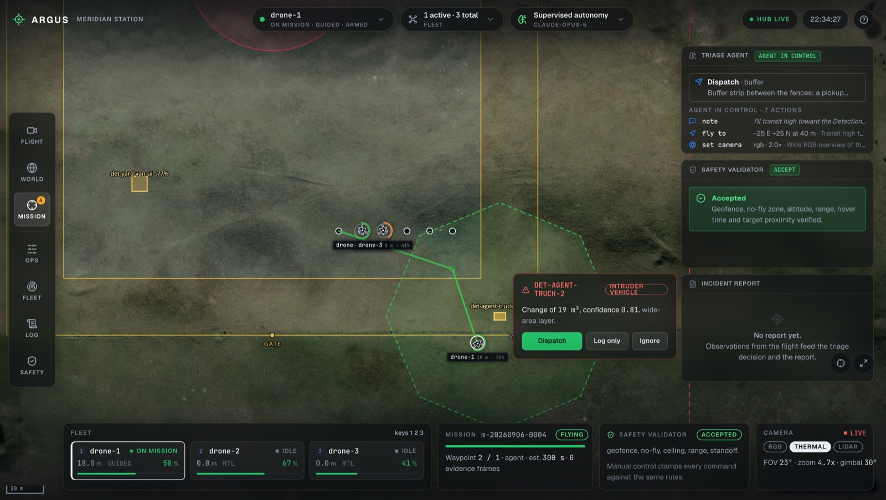
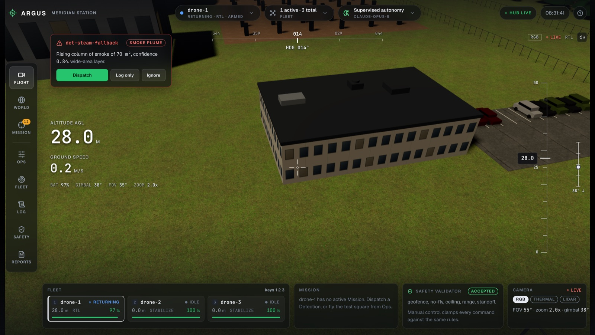
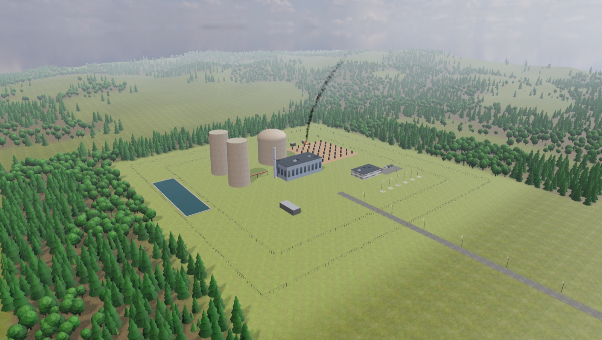
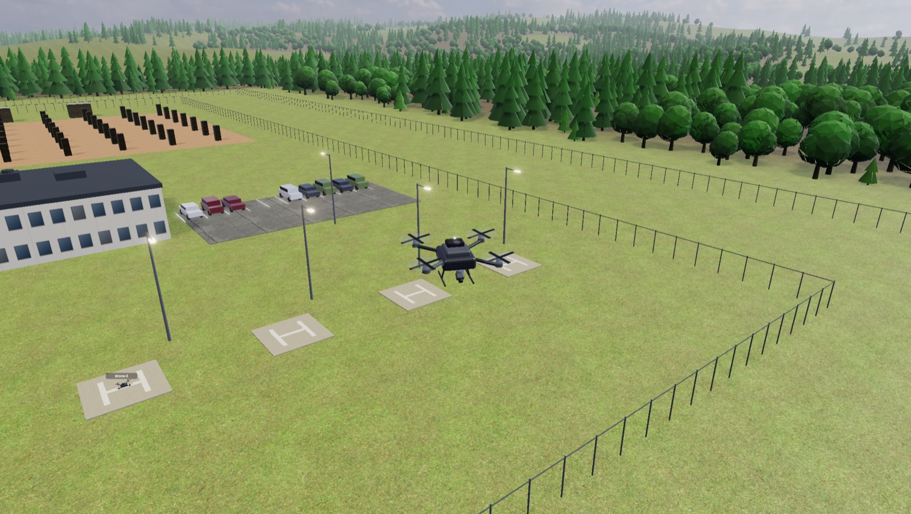
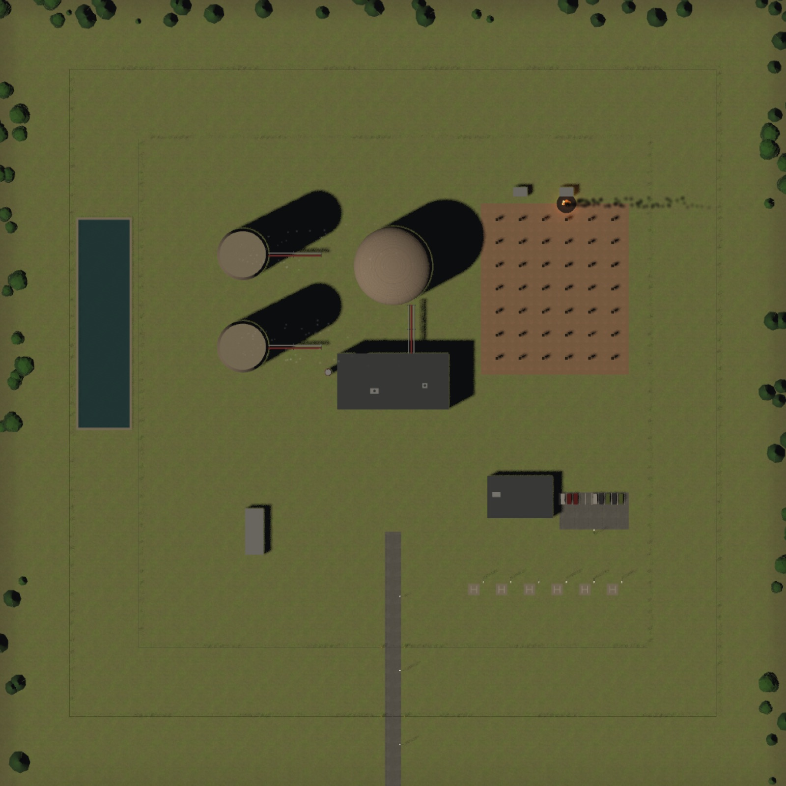
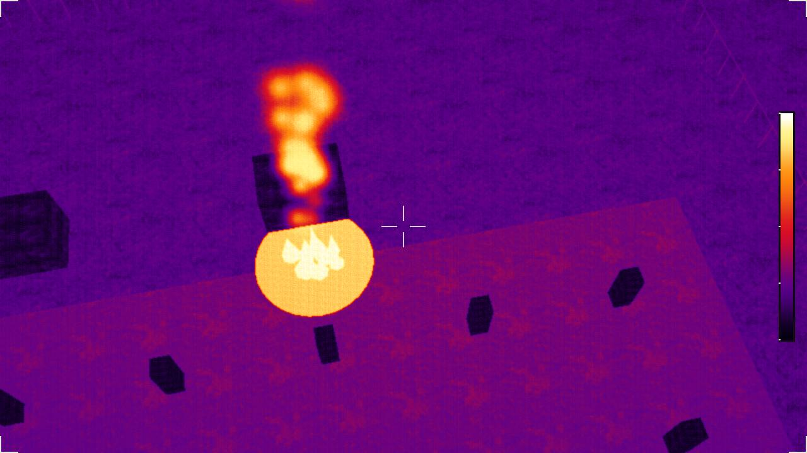
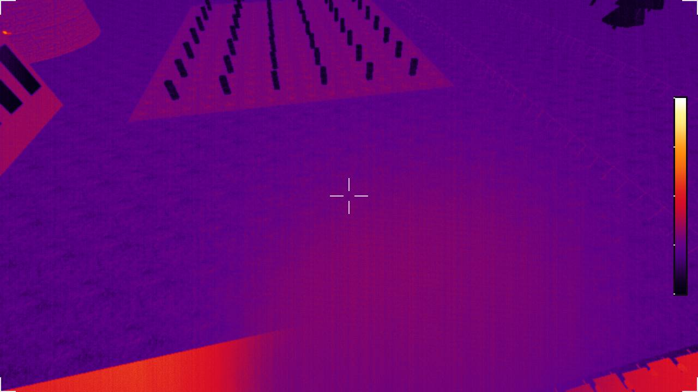

# ARGUS: autonomous drone observability for critical infrastructure

ARGUS watches a nuclear plant from two layers: an overhead pass that notices something has changed, and an AI-flown drone that goes and finds out what it is.

Between the AI and the aircraft sits a trust layer with no AI in it. Every envelope the agent declares, every move it makes in flight and every stick input from a human is checked against the site's geofence, no-fly zones and altitude limits before it reaches the flight controller. The agent can be wrong, or manipulated, and still cannot reach a place the rules forbid.

The flight controller is ArduPilot — the same open-source firmware that flies real multirotors — running in software-in-the-loop simulation. Only the airframe is missing.

Built by a team of four for DNHacks (defense track) on a fictional site, Meridian Station.



## What happens on one anomaly

1. **Detect.** The wide-area layer compares an overhead image before and after, and flags what changed: a rising column in the switchyard, a vehicle at the fence, an object where nothing should be.
2. **Decide whether to fly.** The Triage Agent reads the detection alongside the site context — which zone it fell in, what is normally there, whether maintenance is declared. A contractor van in the service yard during a declared window is logged and no motor spins. Not flying is an answer.
3. **Declare an envelope.** The agent states where it intends to work: a radius, a ceiling, a time budget. It does not state waypoints. The Safety Validator checks that envelope against the site limits and shrinks it, or refuses it, before takeoff.
4. **Fly it.** Inside the envelope the agent has control through tools — fly to, hold, tilt the camera, switch to thermal, zoom, capture. Every move is validated again in the air, and hard stops in code (step budget, time, battery reserve, operator abort) bring the drone home whatever the model says next.
5. **Report.** A written incident report carrying the frames, the agent's on-station assessment, a verdict and a recommended action. A transformer fire escalates as critical: de-energize the bay, dispatch fire response. A steam release from a relief vent looks identical from above, reads cool on thermal, and becomes a maintenance ticket.

Every step is a published event and an audit line, so the operator watches the decision being made rather than only its result.

## Subsystems

| | |
|---|---|
|  | **Ground control dashboard.** Live drone camera with a flight HUD, fleet, missions, the trust column (triage decision, validator verdicts, agent actions with their reasons), incident reports, manual control. React and TypeScript. |
|  | **3D world.** The site in Three.js: terrain, buildings, switchyard, fences, woodland, weather. Scenarios place anomalies into it, such as this transformer fire, and the camera flies to them. 60 fps on a laptop. |
|  | **Aircraft.** Each drone is an ArduCopter instance with its own physics. The model banks and pitches with the autopilot's real attitude; telemetry at 20 Hz with per-frame interpolation. |
|  | **Wide-area layer.** Overhead renders before and after, differenced and georeferenced into detections with a footprint, an area and a confidence. |
|  | **Sensors.** The drone camera renders RGB, thermal (true per-object temperature with sensor noise and palettes) and LiDAR. This is the fire the agent confirmed: the bay saturates the sensor. |
|  | **Same picture, different answer.** The steam release from above looks like the fire. In thermal it reads cool, water vapour, and the report says maintenance ticket, not emergency. |

## Stack

**Hardware.** None is required to run this, and that is the point of the pitch: the flight code is real.

- Flight controller: ArduPilot ArduCopter, built natively for Apple Silicon and run as three software-in-the-loop instances with their own physics, EKF, battery model and onboard geofence. The same firmware runs on a Pixhawk; only the airframe is missing.
- Everything runs on one MacBook: three autopilots, the Hub, both front ends and the renderer.

**Software.**

- `hub/` FastAPI. Drone registry, mission runner, manual control clamping, scenario engine, wide-area detection, the autonomy layer (site context, triage, envelope, agent flight, incident reports), audit log, live WebSocket feed.
- `sim/` The MAVLink bridge between ArduPilot and the Hub, the site generator (one source of truth for geometry, geofence, zones and posture), a fake drone for tests.
- `console/` The Three.js world and drone camera, also the renderer that produces evidence frames and overhead images for the Hub.
- `widearea/` Overhead change detection, two implementations behind one contract: numpy differencing at `/widearea/detect`, which is what the dashboard's Detect button calls, and a Gemini vision detector at `/widearea/vision-detect`, which also classifies the change and describes it. Both return the same Detection, so they are interchangeable and comparable.
- `platform/ground/ui/` The operator dashboard.
- `contracts/` Pydantic models and JSON schemas shared by everything: Detection, MissionSpec, FlightPlan, ValidationResult, DroneState, IncidentReport.
- AI: Claude Opus 5 for triage, the envelope, the flight tool loop and reading the drone's frames on station; Gemini for the overhead before-and-after comparison. Every model call has a rule-based fallback, so the pipeline runs identically with no API key and says on the trail when it has fallen back.

**Trust layer, in three independent lines.** The Safety Validator checks the envelope before any motor turns, shrinking and re-checking it up to three times and naming the rule that refused it. It then checks every `fly_to` again while the drone is airborne, so approval is continuous rather than a single moment. Beneath both, ArduPilot's onboard polygon fence refuses a destination outside it regardless of what the Hub sends — firmware the agent cannot reach. The validator and the fence are configured from the same site geometry, so they cannot disagree about where the boundary is.

Four red-team cases exercise those lines end to end: an illegal first envelope, a prompt injection buried in detection metadata, a change outside the flight envelope, and a plan beyond endurance. Each must end in a refusal that names its rule. On the plan-based path (`ARGUS_FLIGHT_MODE` set to anything other than `agent`) a fourth check applies, the agent's own verifier, but that path is the fallback and not what the demo runs.

## Run it

```bash
uv sync
python scripts/fetch_assets.py                                   # once per machine: CC0 textures, HDRI and models (gitignored)
cd console && pnpm install && pnpm build && cd ..
cd platform/ground/ui && npm ci && npm run build && cd ../../..
uv run python scripts/launch_sim.py --fleet 3 --speedup 1 --wipe --with-hub --renderer
```

Then open http://localhost:8000/ (dashboard) or http://localhost:8000/console/ (3D world).
ArduPilot must be built once per [docs/sim-setup.md](docs/sim-setup.md); `make fake-fleet` substitutes kinematic drones when you do not want it.
Model keys go in a `.env` file at the repo root, which the Hub reads at startup: `ANTHROPIC_API_KEY` for triage, flight and reports, `GEMINI_API_KEY` for wide-area vision.
Both are optional; without them the same pipeline runs on rules and says so.

`uv run pytest` runs 105 tests, including full dispatches against a fake drone: detection, triage, envelope, flight, thermal confirmation, report. One manual-control test is timing-sensitive and fails intermittently; everything else is stable. CI covers `platform/` only, so these suites, `hub/`, `widearea/`, `rails/` and the console build are run by hand.

## Read more

- [docs/DEMO.md](docs/DEMO.md): the demo runbook, fire versus steam.
- [ARCHITECTURE.md](ARCHITECTURE.md): how the pieces connect and why.
- [CONTEXT.md](CONTEXT.md): the domain glossary and the scenarios.
- [docs/sim-setup.md](docs/sim-setup.md): building ArduPilot and running everything on a Mac.
- [docs/ARGUS_AUTONOMY.md](docs/ARGUS_AUTONOMY.md): the autonomy loop in detail; [docs/adr/](docs/adr/): why the environment, flight stack and envelope are what they are; [docs/specs/](docs/specs/): the spec and user stories; [docs/ASSETS.md](docs/ASSETS.md): asset provenance and licences.
- [docs/REPOSITORY_REVIEW.md](docs/REPOSITORY_REVIEW.md), [docs/BASIC_DEMO_PENDING.md](docs/BASIC_DEMO_PENDING.md) and [docs/DISCREPANCY_REWRITE.md](docs/DISCREPANCY_REWRITE.md): provenance, demo gates, and what the platform rewrite removed and re-implemented.

## Repository map

- [`hub/`](hub/) the Hub, [`console/`](console/) the 3D console and renderer, [`widearea/`](widearea/) overhead change detection, [`sim/`](sim/) autopilot launcher, bridge and site generator, [`contracts/`](contracts/) shared models, fixtures and JSON schemas, [`scripts/`](scripts/) launch, smoke test and headless renderer, [`tests/`](tests/).
- [`platform/`](platform/) the operator dashboard, companion software and shared wire contracts; [`rails/`](rails/) an independent oracle for the trust layer with parity harnesses; [`argus-core/`](argus-core/) decision, validation and vision components; [`mock-drone-agent/`](mock-drone-agent/) the planner, verifier and triage the Hub's autonomy layer builds on.
